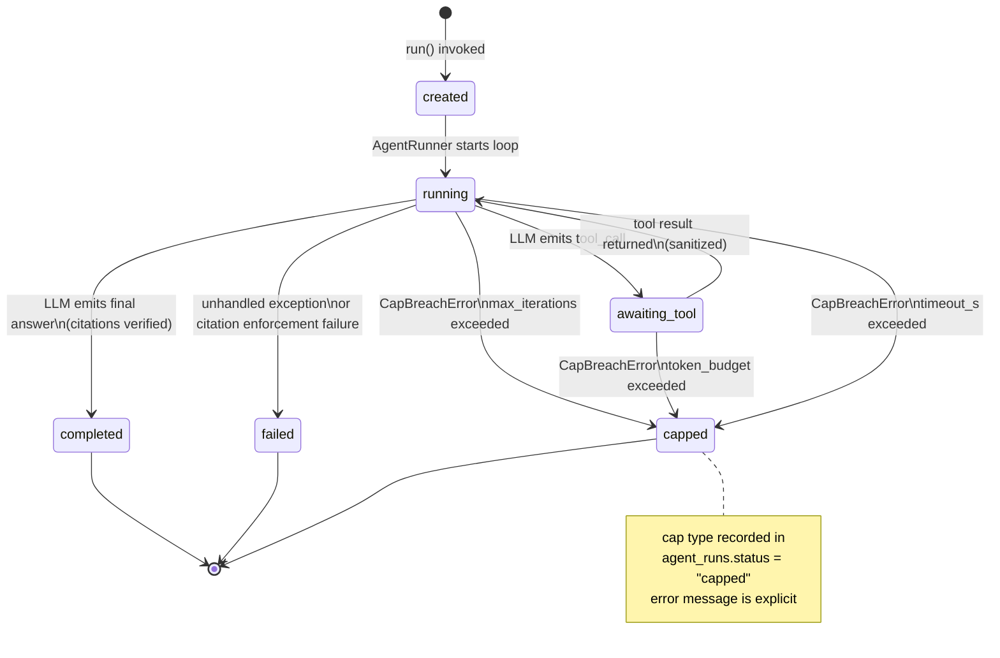

# Agent Run State Machine

Lifecycle of a single agent run, including the cap-breach terminal states.

```mermaid
stateDiagram-v2
    [*] --> created : run() invoked

    created --> running : AgentRunner starts loop

    running --> awaiting_tool : LLM emits tool_call
    awaiting_tool --> running : tool result returned\n(sanitized)

    running --> completed : LLM emits final answer\n(citations verified)

    running --> failed : unhandled exception\nor citation enforcement failure

    running --> capped : CapBreachError\nmax_iterations exceeded
    awaiting_tool --> capped : CapBreachError\ntoken_budget exceeded
    running --> capped : CapBreachError\ntimeout_s exceeded

    completed --> [*]
    failed --> [*]
    capped --> [*]

    note right of capped
        cap type recorded in
        agent_runs.status = "capped"
        error message is explicit
    end note
```
