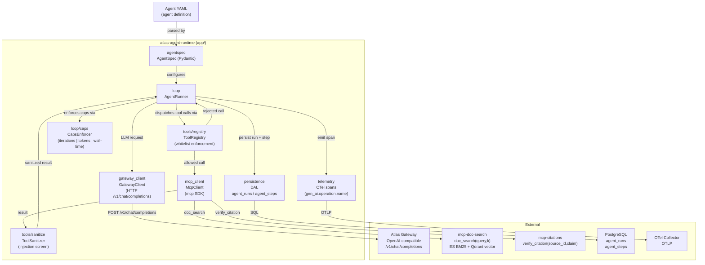

# C4-L3 Component Diagram — atlas-agent-runtime

C4 Level 3 component view of the `app/` modules and their relationships to external systems.

```mermaid
flowchart TD
    subgraph "atlas-agent-runtime (app/)"
        direction TB
        Runner["loop\nAgentRunner"]
        Spec["agentspec\nAgentSpec (Pydantic)"]
        Registry["tools/registry\nToolRegistry\n(whitelist enforcement)"]
        Sanitize["tools/sanitize\nToolSanitizer\n(injection screen)"]
        Persist["persistence\nDAL\nagent_runs / agent_steps"]
        Telemetry["telemetry\nOTel spans\n(gen_ai.operation.name)"]
        GWClient["gateway_client\nGatewayClient\n(HTTP /v1/chat/completions)"]
        MCPClient["mcp_client\nMcpClient\n(mcp SDK)"]
        Caps["loop/caps\nCapsEnforcer\n(iterations | tokens | wall-time)"]
    end

    subgraph "External"
        Gateway["Atlas Gateway\nOpenAI-compatible\n/v1/chat/completions"]
        DocSearch["mcp-doc-search\ndoc_search(query,k)\nES BM25 + Qdrant vector"]
        Citations["mcp-citations\nverify_citation(source_id,claim)"]
        PG["PostgreSQL\nagent_runs\nagent_steps"]
        OTel["OTel Collector\nOTLP"]
    end

    YAML["Agent YAML\n(agent definition)"] -->|parsed by| Spec
    Spec -->|configures| Runner
    Runner -->|enforces caps via| Caps
    Runner -->|dispatches tool calls via| Registry
    Registry -->|allowed call| MCPClient
    Registry -->|rejected call| Runner
    MCPClient -->|result| Sanitize
    Sanitize -->|sanitized result| Runner
    Runner -->|LLM request| GWClient
    GWClient -->|POST /v1/chat/completions| Gateway
    MCPClient -->|doc_search| DocSearch
    MCPClient -->|verify_citation| Citations
    Runner -->|persist run + step| Persist
    Persist -->|SQL| PG
    Runner -->|emit span| Telemetry
    Telemetry -->|OTLP| OTel
```
