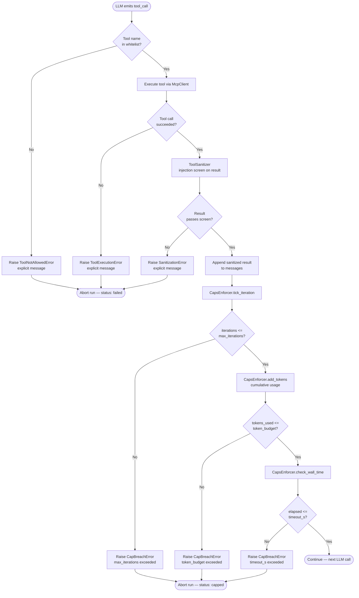

# Loop Control / Hard-Cap Decision Flow

Decision logic for a single tool-call cycle inside the agent loop: whitelist check → execute → sanitize → cap checks → continue or abort.

```mermaid
flowchart TD
    A([LLM emits tool_call]) --> B{Tool name\nin whitelist?}

    B -- No --> C[Raise ToolNotAllowedError\nexplicit message]
    C --> Z([Abort run — status: failed])

    B -- Yes --> D[Execute tool via McpClient]
    D --> E{Tool call\nsucceeded?}

    E -- No --> F[Raise ToolExecutionError\nexplicit message]
    F --> Z

    E -- Yes --> G[ToolSanitizer\ninjection screen on result]
    G --> H{Result\npasses screen?}

    H -- No --> I[Raise SanitizationError\nexplicit message]
    I --> Z

    H -- Yes --> J[Append sanitized result\nto messages]

    J --> K[CapsEnforcer.tick_iteration]
    K --> L{iterations <=\nmax_iterations?}

    L -- No --> M["Raise CapBreachError\nmax_iterations exceeded"]
    M --> ZC([Abort run — status: capped])

    L -- Yes --> N[CapsEnforcer.add_tokens\ncumulative usage]
    N --> O{tokens_used <=\ntoken_budget?}

    O -- No --> P["Raise CapBreachError\ntoken_budget exceeded"]
    P --> ZC

    O -- Yes --> Q[CapsEnforcer.check_wall_time]
    Q --> R{elapsed <=\ntimeout_s?}

    R -- No --> S["Raise CapBreachError\ntimeout_s exceeded"]
    S --> ZC

    R -- Yes --> T([Continue — next LLM call])
```
