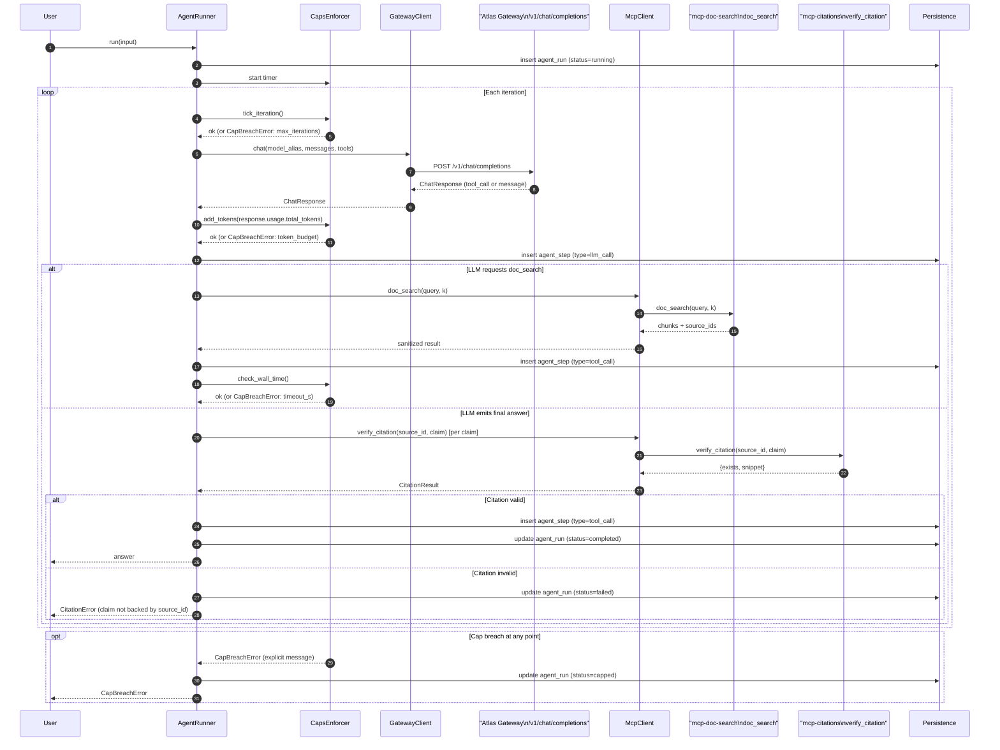

# RegDoc Q&A Agent — Sequence Diagram

End-to-end sequence for the RegDoc Q&A demo agent: LLM call → doc_search → compose answer → citation verification → persist → repeat until done. Cap-breach abort branch shown.

